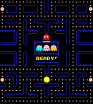
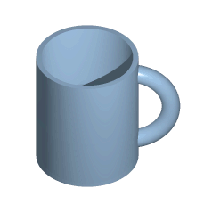
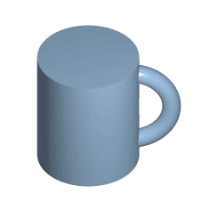
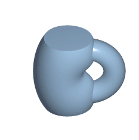
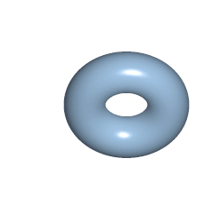
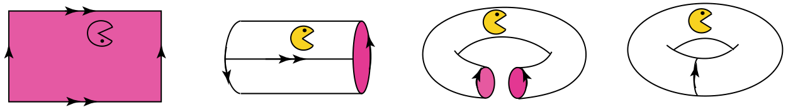

+++
title = "Pac-Man e sua viagem pelo Toro"
date = 2025-09-13T08:00:00-03:00
draft = false

tags = ["petiscos"]
eventos = []

showAuthor = true
autores = ["ana.h"]
+++



Em 1980, o mundo passa a conhecer a hoje famosa cabeça amarela ambulante que percorre um labirinto comendo pastilhas enquanto foge dos quatro fantasmas Blinky, Pinky, Inky e Clyde.

<figure class="mx-auto max-w-fit"> 
    
    <figcaption class="mx-auto max-w-fit">Pac-Man (1980).</figcaption>
</figure>

Eis que o jogador se encontra encurralado, por Clyde, entre uma parede e uma borda. Ora, Pac-Man tem plena consciência de que mora na planolândia mas, como já estava "perdido", decidiu contar com a sorte e ver o que aconteceria caso se forçasse contra a borda.

Espera, o que acabou de acontecer? Isso mesmo: ele reapareceu na borda oposta, na mesma reta de onde entrara em um... portal? Após o ocorrido, Pac-Man conseguiu comer todas as pastilhas e, antes que se _resetasse_ o mapa, aceitou nos ceder uma entrevista exclusiva (em troca de algumas pastilhas).

**Jornal do PET**: Olá, Sr. Pac-Man. Em primeiro lugar, agradecemos o tempo tirado para falar conosco. Agora, nos conte: como foi essa "viagem" até a outra borda?

**Pac-Man**: Obrigado pelas pastilhas. Sobre a viagem, não vi nada. Espero ter ajudado.

Pac-Man não nos ajudou muito, mas está tudo bem, pois existe uma teoria matemática que pode explicar o ocorrido: a _Topologia_.

O problema principal da Topologia consiste em dizer se dois espaços são homeomorfos ou não. Uma aplicação contínua é uma função que leva pontos que estão próximos em outros pontos próximos. Já um homeomorfismo é uma aplicação contínua e inversível entre dois espaços topológicos, cuja inversa também é contínua. Grosso modo, um homeomorfismo é uma "equivalência" entre duas coisas, a princípio, diferentes, onde uma pode ser transformada na outra por meio de deformações contínuas — como se fosse brincar de massinha, deformando livremente o espaço, esticando ou apertando, sem rasgar ou colar pontos distantes. Talvez o exemplo mais popular seja o homeomorfismo entre uma caneca e uma rosquinha.

    <figure class="mx-auto max-w-fit"> 
        
    </figure>
    <figure class="mx-auto max-w-fit"> 
        
    </figure>
    <figure class="mx-auto max-w-fit"> 
        
    </figure>
    <figure class="mx-auto max-w-fit"> 
        
    </figure>

<figcaption class="mx-auto max-w-fit">Homeomorfismo entre uma caneca e uma rosquinha (Fonte: Vieira, 2007).</figcaption>

Não é à toa que o coitado do Pac-Man não sabia o que ocorreu. Assim como não conseguimos visualizar tão intuitivamente o mundo em \\(3 + 1 = 4\\) dimensões, Pac-Man não consegue fazê-lo em \\(2 + 1 = 3\\) dimensões. Mas como é possível, então, que ele tenha se teletransportado de uma parede à outra do labirinto, como num passe de mágica? A resposta está na Topologia: o labirinto retangular cujas bordas se conectam é homeomorfo ao Toro \\(\mathbb{T}^2\\), a superfície em formato de rosquinha.

Tal homeomorfismo pode ser visualizado, na nossa dimensão, ao fazermos a _identificação_ de um par de arestas (por exemplo, as verticais) do retângulo onde vive o Sr. Pac-Man e, em seguida, a identificação do outro par de arestas (agora as horizontais). Devemos notar que o modo com o qual essa identificação é feita é importante para determinarmos a superfície resultante. Nesse caso, em particular, identificamos o primeiro par de arestas de modo direto. No entanto, poderíamos ter feito um giro de 180 graus antes da identificação do primeiro par e seguido normalmente com a do outro par de arestas. Isso geraria uma superfície diferente e, de fato, não homeomorfa ao agora familiar Toro. Essa superfície é chamada de Garrafa de Klein, a qual não precisamos nos preocupar no momento pois, à luz do mais recente incidente com Sr. Pac-Man, sabemos que lidamos com o Toro. Essa ideia de identificação é formalizada a partir do conceito de _relação de equivalência_, na qual os pontos de um espaço topológico podem ser mapeados um no outro por meio de uma transformação contínua que preserva a estrutura topológica desse espaço, ou seja, por um homeomorfismo! No caso do retângulo com identificação direta, os pontos das bordas são "levados" aos seus correspondentes — pontos com exatamente uma das respectivas coordenadas iguais — na aresta oposta e os pontos interiores o são a eles próprios.

<figure class="mx-auto max-w-fit"> 
    
    <figcaption class="mx-auto max-w-fit">Identificação das arestas opostas do labirinto retangular (Fonte: Marar, 2023).</figcaption>
</figure>

Isso explica por que o Pac-Man consegue viajar de uma borda para outra, mas certamente não explica por que o primeiro nome de seu criador é Tōru...

**Referências**:
[1] MARAR, Ton. _Topologia Geométrica para Inquietos_. São Paulo: Edusp, 2023.
